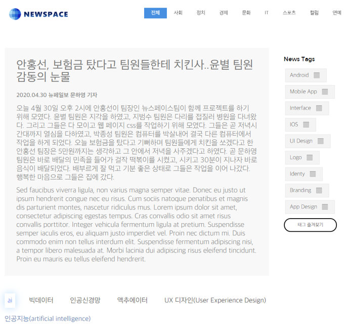

# Leveraging-Deep-Learning-And-Metadata-Customized-News-Delivery-Service
이 프로젝트는 뉴스 기사의 특성을 뽑아 메타데이터를 생성하여 사용자별 맞춤 기사를 제공하기 위한 딥러닝과 메타데이터를 활용한  사용자 맞춤 뉴스 제공 서비스입니다.

***

## NewSpace

안홍선 
김석영 
박종성 
지범수 
문하영 
윤  별 

***

## 프로젝트 수행 과정
> 핵심과제

1. 뉴스 기사의 특성을 뽑아 메타데이터(데이터를 설명하는 데이터) 생성
2. 메타데이터를 활용하여 형태별(사실전달/해설묘사) 기사 제공
3. 기사 요약 서비스 제공
4. 기사에 나오는 어려운 용어들 각주로 설명
5. 기사 스크랩, 즐겨찾기 기능 제공

> 접근 방식

1. 크롤링한 뉴스 데이터를 직접 사실전달과 해설 묘사로 라벨링하여 분류한다.
2. 딥러닝을 통해 분류된 기사를 학습시켜 분류 되지 않은 뉴스의 형태를 예측하여 정확도를 확인한다.

***
## 화면 구성

</img>
</img>
</img>
</img>
</img> 
***
## DB

</img> 

> 테이블
1. 사용자 : 사용자 ID, 비밀번호, 이름, 연령대, 성별, 이메일
2. 뉴스 : 뉴스 번호, 제목, 요약, 기자, 시간, 언론사, 메타 데이터, 기사 내용, 이미지, 카테고리, 조회수
3. 태그 : 태그 번호, 태그 이름
4. 용어 분야 : 용어 분야 번호, 분야 이름
5. 용어 : 용어 번호, 용어 분야 번호, 용어 이름, 용어 설명

***
## 딥러닝

> ## 텍스트 마이닝 

</img>
</img> 

    형태소 분석기 패키지인 Konlpy 사용하여 안에 있는 Okt 형태소 분석기 사용
    Word2vec 사용하여 단어 토큰화 후 코사인 유사도 비교하여 중요단어 산출
    Glove 모델 사용하였지만 Word2vec 코사인 유사도 보다 낮아 Word2vec 사용ADd

> ## 세줄 요약 TextRank 모델

</img>     
    
    문서에서 의미 있는 단어를 추출하고, 단어의 출현 횟수와 문서의 수에 따른 각 단어의 가중치를 산출하고,
    가중치가 높은 단어들에 대하여 연관용어 집합을 구성하고 분야별 대표 색인어를 추출하고, 
    추출된 대표 색인어와 문서간의 유사도를 이용하여 문서를 자동으로 분류하는, 
    본문 텍스트에서 형태소 분석을 하여, 불용어를 제거하고, 동의어를 처리하여, 단어들을 추출하는 단계 
    추출한 각 단어들에 대하여, 각 문서에 대한 단어 가중치를 계산하고, 상기 문서에 대한 단어 가중치를 평균하여, 해당 단어의 단어 가중치를 산출하는 단계
    문서나 산출물들을 보다 정확하게 분야별로 분류할 수 있고, 이를 통해, 보다 정확한 분야별 검색을 제공할 수 있다.

> ## Char-level-CNN
</img> 

    1. 글자 단위의 Convolutional Network 문서 분류에서 높은 성능을 보인다.
    2. 작은 데이터셋에서는 전통적인 NLP방식이 DL방식보다 더 높은 성능을 보인다.
    3. ConvNet은 사용자가 만든 데이터에서 좋다.(오타를 잘 잡는다)
    4. Alphabet의 선택에 따라 성능이 많이 달라진다.
    5. Bag-of-means 모델은 안좋다.
    6. 모든 데이터셋에 있어 최적의 모델은 없다.( 많은 실험을 통해 데이터셋에 가장 적합한 모델을 찾아야 한다)

        link : https://github.com/srviest/char-cnn-text-classification-pytorch
